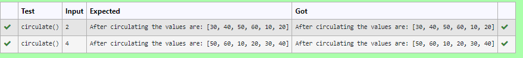

# Circulate-the-values-of-N-variables
## Aim:
To write a python program to circulate the n variables using function concept
## Equipment’s required:
PC
Anaconda - Python 3.7
## Algorithm: 
### Step 1: def fuction 
### Step 2: input by the user 
### Step 3: print statment 
Get the value from the user for the number of rotation
### Step 4: 
Using the slicing concept rotate the list
## Program:
~~~
def circulate(): 
    num1=[10,20,30,40,50,60]
    n=int(input())
    num1=num1[n:]+num1[:n]
    print("After circulating the values are:",num1)
~~~

## Output:

## Result:
Hence the output has been displayed 
